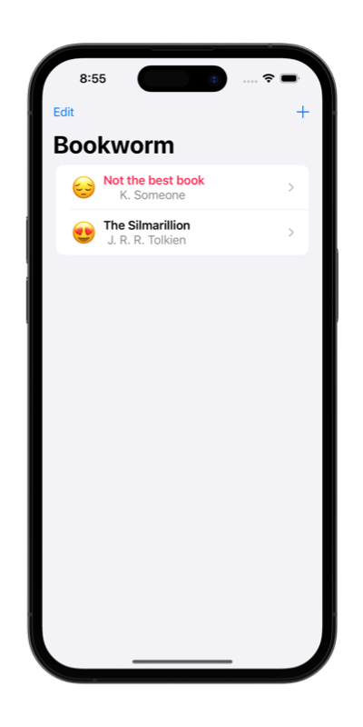
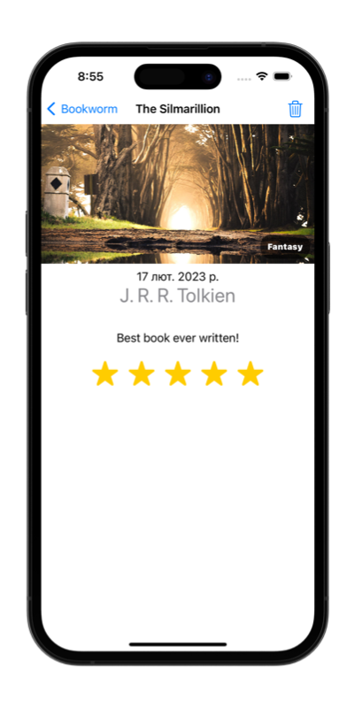

# &nbsp; 📖 Bookworm 

### Project 11
##### Author: *[MatviiArtemenko](https://github.com/100DaysOfSwiftUI-MatviiArtemenko)*

##### 100DaysOfSwiftUI form *[@twostraws](https://twitter.com/twostraws "twostraws twitter page")*

##### Follow along: *[100DaysOfSwiftUI](https://www.hackingwithswift.com/100/swiftui "Hacking with Swift")*

---

> *Congratulations on finishing another SwiftUI project! With technologies like Core Data at your side, you’re now capable of building some serious apps that interact with the user and – most importantly – remember what they entered. Although we only scratched the surface or Core Data, it’s capable of a lot more and I expect Apple to keep expanding the link between Core Data and SwiftUI in future updates. In the meantime, the very next project focuses deeply on Core Data – there’s lots to explore!.*

---

## &nbsp; 📚 Covered topics

Basics of Core Data 

---
## &nbsp; 🎖 Challenge
* [x] Right now it’s possible to select no title, author, or genre for books, which causes a problem for the detail view. Please fix this, either by forcing defaults, validating the form, or showing a default picture for unknown genres – you can choose

* [x] Modify `ContentView` so that books rated as 1 star are highlighted somehow, such as having their name shown in red.

* [x] Add a new “date” attribute to the Book entity, assigning `Date.now` to it so it gets the current date and time, then format that nicely somewhere in `DetailView`.
 

---
## &nbsp; 📲 Screenshoot

  
  
  

---
##  &nbsp; 🔍 &nbsp; Resources 

* [Hacking With Swift - Bookworm](https://www.hackingwithswift.com/books/ios-swiftui/bookworm-wrap-up)
* [Apple documentation - Core Data](https://developer.apple.com/documentation/coredata/)
